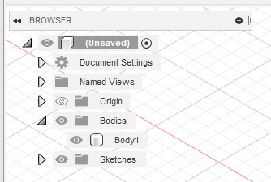
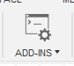

Fusion Descriptor - Getting Started
=================

Creating a Fusion 360 Model
-----------------

**Tutorial**

- Navigate to the *Solid* tab at the top of the screen and click on *Create Sketch*.
- 
- Choose a plane to work on by clicking any of the highlighted squares. At the top of your screen, you should now be under the *Sketch* tab.
- 
- Click on the *2-Point Rectangle* and drag on the workspace to create a rectangle with a size of your choosing. 
- 
- Click on *Finish Sketch*. You should now be back under the *Solid* tab.
- Click on *Extrude* and drag on the rectangle that you have created until you have a 3d shape of your choosing. Click on on *OK*.
- 
- Now, you should have a 3d shape categorized under *Bodies* on the left side.
- 
- Create a second rectangle following the above instructions that is adjacent to the first one. Make sure they are touching in some way.
- 
- You can move a body by clicking on it on the left side and clicking *Move/Copy*.
- 
- Right click on *Bodies* and click on *Create Components from Bodies*. Both bodies should now be *Components*.
- 
- Make sure that one of these components are grounded. To do so, right click on the component on the left side and click on *Ground*. 
- A red indicator should appear next to the name of the component that shows it is grounded.
- 
- Now, go to the *Surface* tab and click on *Joint*.
- 
- Add the joint where the two components are touching. A *Joints* category should appear on the left side.
- Navigate to the *Utilities* tab at the top of the screen and click on *Scripts and Add-Ins*.
- 
- Click on the green + to add the script into Fusion 360.
- 
- Add the *Descriptor* folder from the zip file to the scripts.
- Click on *Descriptor* then click on *Run*. The GUI will appear.
- Add a save directory for the output and select the desired options.
- 
- Click on *Generate*. The output can be found where the save directory is.
