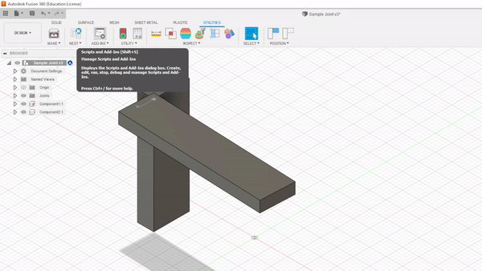

Fusion Descriptor
=================

Important Credits
-----------------

This a modified version of the fusion2urdf (https://github.com/syuntoku14/fusion2urdf) and fusion2pybullet (https://github.com/yanshil/Fusion2PyBullet) repositories. Many thanks for these authors and their communities building out the tools and showing what was possible.  

**Why Another?**

This project was developed to solve some internal problems with our robot configuration and exporting. Between the stated end of development for the original repo and the priorities of the pybullet version, we felt it was best to make our own version and rewrite most of the fusion-side code.  Naturally, we also wanted to understand the fusion API better, so this was a nice project to get started. 

Overview
--------

This project aims to help export link configurations and mechanical descriptions to XML (e.g. URDF) formats (and ideally, other formats as well in the future), from Fusion 360. 

It provides a simple GUI for running the script and choosing a few different settings.  

**Features**

- GUI interface for settings
- Uses the grounded base as root node
- Allows switching between units
- WYSIWYG stl exporting (exports model as you see on the screen) without needing to save design history or copy to a new file
- Preview joint relationship before exporting
- Export only URDF without Mesh (for fast viewing)
- Set Component 1 of joint to mean Parent or Child

Step-by-Step Guide
------------------

*TODO*

