Fusion Descriptor - Getting Started
=================

Installation & Running
-----------------

- Download the repository as .zip or run `git clone https://github.com/cadop/fusion360descriptor.git` in Git Bash to download the repository.
- Navigate to the **Utilities** tab in Fusion and click on **Scripts and Add-Ins**.
- Click on the green + to add the script into Fusion.
- Add the **Descriptor** folder from the zip file to the scripts. You may have to unzip the file after downloading from Github
- Click on **Descriptor** then click on **Run**. The GUI will appear.
- Rather than configuring the export manually in the GUI, you can create a YAML configuration file to control the export. A number of more
  advanced features are only available via the configuraiton file. See `configuration_sample.yaml` for more information.

An extensive, step by step procedure can be found at [Step-by-Step Guide](#step-by-step-guide).

FAQ
-----------------

**Q:** How can I visualize the URDF generated by my Fusion model?

**A:** We recommend PyBullet; the converter generates a sample `hello_bullet.py` to get started with your URDF.

**Q:** How do I install PyBullet?

**A:** Ensure that Python, pip, and Microsoft Visual Studio C++ build tools are installed. Check with `which python` and `which pip`. At the command line, run `pip install pybullet`.

**Q:** How can I create more advanced models?

**A:** A good place to find pre-built components is the *McMASTERR-CARR* component directory. To go to this, click on **Insert** in the top menu bar, and in the drop down menu, go to **Insert McMASTERR-Carr Component**. Then, you can find your desired component, click on the specifications of choice, go to **Product Detail**, and press **Download**.

Installation & Running
-----------------

- Download the repository as .zip by clicking the green **Code** button above and then **Download Zip**.

- Unzip to a permanent folder of your choice.
- Navigate to the **Utilities** tab in Fusion and click on **Scripts and Add-Ins**.

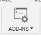 

- Click on the green + to add the script into Fusion.

- Add the **Descriptor** folder from the extracted files to the scripts. 

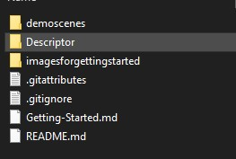

- Click on **Descriptor** under **My Scripts** then click on **Run**. The GUI will appear.

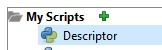

Step-by-Step Guide
------------------

**Creating a Fusion Model**

- Navigate to the **Solid** tab at the top of the screen and click on **Create Sketch**.

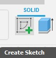

- Choose a plane to work on by clicking any of the highlighted squares. At the top of your screen, you should now be under the **Sketch** tab.

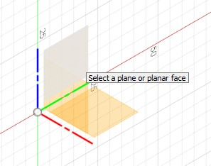

- Click on the **2-Point Rectangle** and drag on the workspace to create a rectangle with a size of your choosing. 

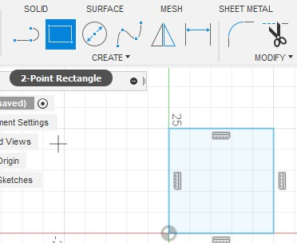

- Click on **Finish Sketch**. You should now be back under the **Solid** tab.
- Click on **Extrude** and drag on the rectangle that you have created until you have a 3D shape of your choosing. Click on on **OK**.

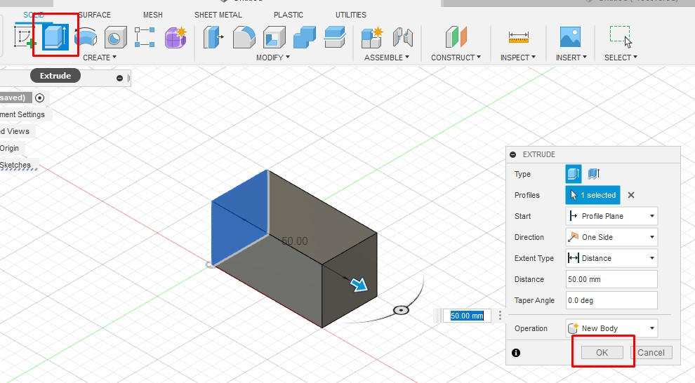

- Now, you should have a 3D shape categorized under **Bodies** on the left side.

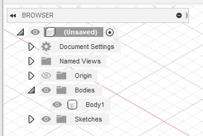

- Create a second rectangle following the above instructions that is adjacent to the first one. Make sure they are touching in some way.

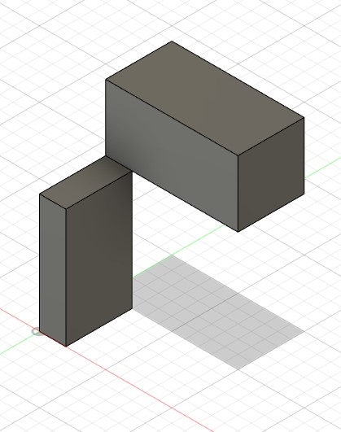

- You can move a body by right clicking on the body name on the left side and clicking **Move/Copy**, or by pressing **M** on the keyboard.

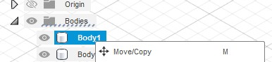

- Right click on **Bodies** and click on *Create Components from Bodies*. Both bodies should now be **Components**.

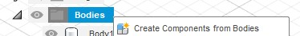

- Make sure that one of these components are grounded. To do so, right click on the component on the left side and click on **Ground**. 
- A red indicator should appear next to the name of the component that shows it is grounded.

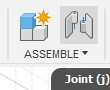

- Now, go to the **Surface** tab and click on **Joint**.

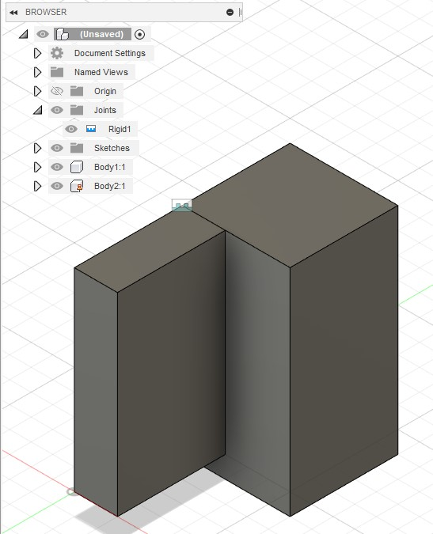

- Add the joint to each component, where they are touching. Make sure this joint has motion type **Rigid**. A **Joints** category should appear on the left side.
- Navigate to the **Utilities** tab at the top of the screen and click on **Scripts and Add-Ins**.

- Click on the green + to add the script into Fusion.

- Add the **Descriptor** folder from the zip file to the scripts.
- Click on **Descriptor** then click on **Run**. The GUI will appear.
- Add a save directory for the output and select the desired options.
- Note: rather than selecting the desired export options manually in the GUI (and having to re-enter them every time you want to re-export),
  you can create a YAML configuration file to control the export. Also, a number of more advanced features are only available via the
  configuraiton file. See `configuration_sample.yaml` for more information.

- Click on **Generate**. The output can be found where the save directory is.

